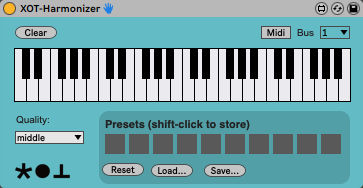

# XOT-Harmonizer

Max for Live Harmonizer effect, with 4 stereo voices. Can be MIDI remote controlled.

(c) Jaap-Henk Hoepman (info@xot.nl)

Released under the [MIT](https://opensource.org/licenses/MIT) license. 

## Description

XOT-Harmonizer derives four stereo voices from its stereo input, pitch-shifted in almost real time based on the (at most four) notes played on the virtual keyboard. Middle C (C-3) is the ground tone; best results are achieved using notes within an octave of this ground tone. The delay between the original input signal and the pitch shifted output signal is 45 ms. (at sampling rate of 44.1 kHz due to a buffer size of 2048).

The original stereo input (i.e. the ground tone) is provided unchanged on the stereo output of the Harmonizer effect. The four voices are sent (in lowest to highest pitch order) on the following additional effect outputs

- 3/4 XOT-Harmonizer
- 5/6 XOT-Harmonizer
- 7/8 XOT-Harmonizer
- 9/10 XOT-Harmonizer

These have to be separately connected to by different Audio (sub)tracks, see the Ableton Live template provided for how to achieve this. It is convenient to create a Group track in which the first sub track contains the Harmonizer while the following four sub tracks each receive one of the stereo voice outputs. This way, individual voices can be independently panned and attenuated. The output of each track is then mixed and the group track slider can be used to control the overall volume.

If fewer than four notes are played on the keyboard, the remaining voice outputs are automatically muted.

## MIDI remote control

The harmonizer can also be MIDI remote controlled. To do so, place a MAX MIDI Sender effect on a MIDI track, and set it to send on the same MIDI bus a set on the harmonizer. Switch on MIDI remote control by clicking the 'Midi' button on the harmonizer. MIDI notes played on this MIDI track will now determine the notes generated by the harmonizer. Note: at most four notes should be on at the same time, if not, it is undefined which notes will actually be generated.

## Presets

Ten presets can be stored and retrieved, and saved to an external file. The preset states are saved with the Abelton Live set containing this device.

## Ableton Live template

See the Ableton Live template provided (./Harmonizer template.als) for a complete setup of XOT-Harmonizer with four panned stereo voices active, and a separate MIDI track that can control the harmonizer.
